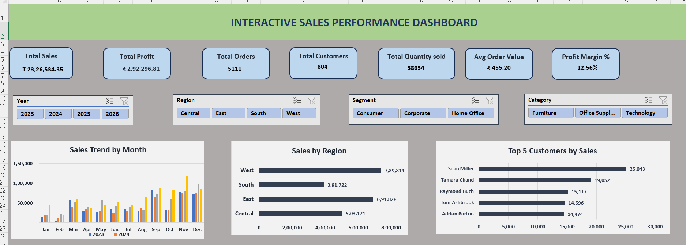

# 📊 Interactive Sales Performance Dashboard

## 📌 Project Overview 


This project is an interactive **Sales Performance Dashboard** built using **Microsoft Excel** to analyze and visualize sales data from the Superstore Sales dataset. The dashboard provides valuable business insights through dynamic KPIs, Pivot Tables, Pivot Charts, and Slicers, enabling users to monitor sales performance across multiple dimensions.

---

## 📷 Dashboard Preview



---

## ✨ Key Features

- 📈 Interactive KPI Cards
- 📊 Pivot Tables & Pivot Charts
- 🎯 Dynamic Slicers for easy filtering
- 📅 Monthly Sales Trend Analysis
- 🌍 Regional Sales Analysis
- 👥 Customer Performance Analysis
- 📦 Product Performance Analysis
- 🏷️ Category-wise Sales Analysis
- 👤 Segment-wise Sales Analysis

---

## 📊 KPI Metrics

The dashboard tracks the following business KPIs:

- 💰 Total Sales
- 💵 Total Profit
- 📦 Total Orders
- 👥 Total Customers
- 📦 Total Quantity Sold
- 💳 Average Order Value
- 📈 Profit Margin %

---

## 🎛 Interactive Filters

Users can filter the dashboard using:

- 📅 Year
- 🌍 Region
- 👤 Segment
- 🏷️ Category

---

## 🛠 Tools & Technologies

- Microsoft Excel
- Pivot Tables
- Pivot Charts
- Slicers
- Power Query
- Data Cleaning
- Data Visualization

---

## 📂 Repository Contents

```
Interactive-Sales-Performance-Dashboard
│
├── Sales_Performance_Dashboard.xlsx
├── Dashboard.png
├── Lookup.png
├── Pivot_Table.png
└── README.md
```

---

## 📈 Dashboard Insights

This dashboard helps analyze:

- Monthly Sales Trends
- Sales Performance by Region
- Top 5 Customers by Sales
- Top 5 Products by Sales
- Sales Distribution by Category
- Sales Distribution by Customer Segment

---

## 🚀 How to Use

1. Download the Excel workbook.
2. Open it using Microsoft Excel (2019 or later).
3. Go to the **Dashboard** worksheet.
4. Use the interactive slicers to filter the data dynamically.
5. Explore KPIs and charts for business insights.

---

## 🎯 Skills Demonstrated

- Data Cleaning
- Business Intelligence
- Dashboard Design
- KPI Development
- Data Visualization
- Pivot Tables
- Pivot Charts
- Interactive Reporting
- Excel Analytics

---

## 👩‍💻 Author

**Mala Kumari**

🎓 BCA Graduate | Aspiring Data Analyst

📧 Email: Mala2703kri@gmail.com

🔗 LinkedIn: https://www.linkedin.com/in/mala2703

🔗 GitHub: https://github.com/Mala2703

---

⭐ If you found this project helpful, feel free to star the repository!
